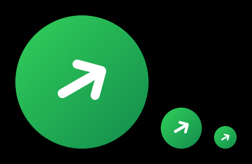

# Sugar Link



Your FreeStyle Libre 3 readings on your Apple Watch: as a **complication** on your watch face, and as a
**full-screen watch app** with time, glucose, trend arrow, a chart and steps.

It's a **watch-only app**: no iPhone app, no server. The watch fetches readings itself from **LibreLinkUp**,
Abbott's follower service, over Wi-Fi or cellular.

> **Not a medical device.** For checking at a glance only. Readings can be several minutes old, and LibreLinkUp's
> API is unofficial: Abbott can change it at any time and the app stops working until it's updated. Don't make
> treatment decisions from this app. Use your official Libre app or reader for that.

Sugar Link isn't on the App Store. You build it yourself with Xcode and install it on your own watch; the steps are below.

## What you need

| | |
|---|---|
| Mac | with **Xcode 16 or later** (free, Mac App Store) |
| Apple Watch | watchOS 10 or later, paired with your iPhone |
| Apple ID | a free one works (see [Free or paid account](#free-or-paid-apple-account)) |
| Libre | a FreeStyle Libre 3 sensor and app, plus a **LibreLinkUp** follower account |
| Homebrew | to install XcodeGen ([brew.sh](https://brew.sh)) |

## 1. Set up a LibreLinkUp follower account

1. In the **FreeStyle Libre 3** app: Menu → Connected Apps → LibreLinkUp → add a connection and enter an email
   address. A different email from your LibreView login works best.
2. Install **LibreLinkUp** on your iPhone, sign up with that email, accept the invite and the terms.
   Check that you can see your readings there. Sugar Link logs in with this account.

## 2. Get the code and create the Xcode project

```sh
brew install xcodegen
git clone https://github.com/anishhm/sugar-link.git
cd sugar-link
```

Open `project.yml` and change two lines at the top:

```yaml
BASE_BUNDLE_ID: com.yourname.sugarlink   # must be unique to you: use your own name
DEVELOPMENT_TEAM: ""                      # your Team ID, or leave empty and pick the team in Xcode
```

The bundle ID `com.anishhm.sugartracker` already belongs to another account, so Xcode refuses to sign with it.
Any reverse-domain name of your own works.

Then create the project and open it:

```sh
xcodegen
open SugarLink.xcodeproj
```

Run `xcodegen` again whenever you change `project.yml`. It replaces `SugarLink.xcodeproj`.

## 3. Sign in to Xcode and pick your team

1. Xcode → Settings → **Accounts** → **+** → Apple ID, and sign in.
2. In Xcode's left sidebar, click the **SugarLink** project. Then for **both** targets (`SugarLinkWatch` and
   `SugarLinkWidgets`) open **Signing & Capabilities** and choose your **Team**. A free account shows up as
   "Your Name (Personal Team)".

To skip this step after every `xcodegen`, copy your Team ID into `DEVELOPMENT_TEAM` in `project.yml`. You
can find it in either target's **Build Settings** under "Development Team" once you've picked the team.

## 4. Prepare your watch

1. Connect your **iPhone** to the Mac with a cable the first time (later, the same Wi-Fi network is enough) and tap
   **Trust**. The watch is reached through the iPhone.
2. In Xcode: Window → **Devices and Simulators**. Wait until your watch appears and finishes "Preparing". This
   can take several minutes the first time. Keep the watch on its charger and unlocked.
3. Turn on **Developer Mode** when asked:
   - iPhone: Settings → Privacy & Security → Developer Mode
   - Watch: Settings → Privacy & Security → Developer Mode

   Each one restarts and asks you to confirm.

## 5. Install

1. In Xcode's toolbar, choose the **Sugar Link** scheme and your **Apple Watch** as the destination.
2. Press **Run** (⌘R).
3. **Free account only:** the first launch fails with "untrusted developer". On the **watch**, go to Settings →
   General → VPN & Device Management, tap your Apple ID and trust it. Then press Run again. If that menu isn't
   on the watch, open the same screen on the iPhone.

## 6. Log in on the watch

Open **Sugar Link** on the watch and log in with your LibreLinkUp follower account. Allow Health access when
asked (only today's step count is read).

Typing on the watch: tap the Email field. If a "Apple Watch Keyboard Input" notification shows on your iPhone,
tap it to type there; the iPhone's saved passwords work too. Otherwise use the watch keyboard, Scribble or
dictation. You only log in once.

## 7. Put it on a watch face

Long-press the watch face → **Edit** → Complications, and choose **Sugar Link → Glucose** for a slot.
Good faces: **Modular** / **Modular Duo** (large slot with a 3-hour chart), **Infograph**, **Wayfinder**.

| Complication | Shapes | Shows |
|---|---|---|
| Glucose | circular, corner, inline, rectangular | value and trend arrow; rectangular adds change per 5 min, age and 3 hours of bars |
| Steps | circular, corner, inline | today's steps |

| Color | Default range |
|---|---|
| Red | below 70 mg/dL |
| Green | 70–149 |
| Orange | 150–180 |
| Purple | above 180 |
| Gray | reading is old (over 15 minutes) |

**Settings:** tap the small gear at the top left of the app. There you change the limits, the unit (mg/dL or
mmol/L), whether the chart and steps show, and log out.

## Free or paid Apple account

| | Free Apple ID | Apple Developer Program ($99/year) |
|---|---|---|
| Install on your own watch | yes | yes |
| How long an install lasts | **7 days**, then the app won't open | 1 year |
| Your own apps per device | 3 | unlimited |
| Share with others (TestFlight) | no | yes |

**With a free account, reinstall every week:** open the project in Xcode, choose your watch and press Run. Your
login and settings stay on the watch. When the install expires, the app won't open and the complication stops
updating, so renew it before you depend on it (for example every Sunday).

## How fresh is it?

- **Full-screen app:** fetches every minute while it's open, and again when you raise your wrist. Tap the value
  to refresh. Readings are about 1–2 minutes old.
- **Complication:** watchOS decides how often third-party complications refresh, usually every 5–15 minutes when
  it's on your current face. Each refresh fetches the newest reading. LibreLinkUp itself is about 1 minute
  behind the sensor.

**For the freshest value, keep the app on screen:**

1. On the watch: Settings → General → Return to Clock → **After 1 hour**.
2. Same screen → **Sugar Link** → turn on **Return to App**.
3. Open Sugar Link. It stays on screen (dimmed with your wrist down) and refreshes when you raise your wrist.

## Troubleshooting

| Problem | What to do |
|---|---|
| Xcode: "Failed to register bundle identifier" / "not available" | Change `BASE_BUNDLE_ID` in `project.yml` to something of your own and run `xcodegen` again. |
| Xcode: "No account for team" / "Signing requires a development team" | Pick your Team for **both** targets (step 3). |
| Xcode: "Your maximum App ID limit has been reached" | Free accounts can register 10 App IDs per week. Wait a few days, or reuse a bundle ID you already registered. |
| Watch doesn't appear in Xcode | Unlock the iPhone and watch, keep them close, check Developer Mode is on, and wait for "Preparing" to finish. Restarting the watch, iPhone and Xcode helps surprisingly often. |
| App won't open after a week | The free 7-day install expired. Run from Xcode again. |
| Wrong LibreLinkUp email or password | Check you can log in to the LibreLinkUp iPhone app with the same details. |
| Accept the terms | Open the LibreLinkUp iPhone app and accept the new terms. |
| Doesn't follow anyone | Send the invite from the Libre 3 app and accept it in LibreLinkUp. |
| Logins suddenly fail for everyone | LibreLinkUp may require a newer app version: raise `appVersion` in `Shared/LibreLinkUpClient.swift`. |
| Complication says "Open Sugar Link to log in" | Open Sugar Link on the watch and log in. |

## Privacy

Your LibreLinkUp email and password are stored only in the watch's Keychain and sent only to Abbott's
LibreLinkUp servers (`api.libreview.io` and its regional servers). There's no analytics and no other server.
Step counts are read from Health on the watch and never leave it.

## Project layout

| Folder | What |
|---|---|
| `Shared/` | LibreLinkUp client, models, settings, Keychain and App Group storage, chart (used by both targets) |
| `Watch/` | Watch app: login, full-screen view, settings, fetching, background refresh, steps |
| `Widgets/` | Watch complications (WidgetKit) |
| `design/mockups/` | Design previews and the script that draws the app icon (`generate_icon.swift`) |
| `project.yml` | XcodeGen spec: the Xcode project is generated from this |

## License

[MIT](LICENSE). Sugar Link isn't affiliated with or endorsed by Abbott. FreeStyle Libre and LibreLinkUp are trademarks of Abbott.
